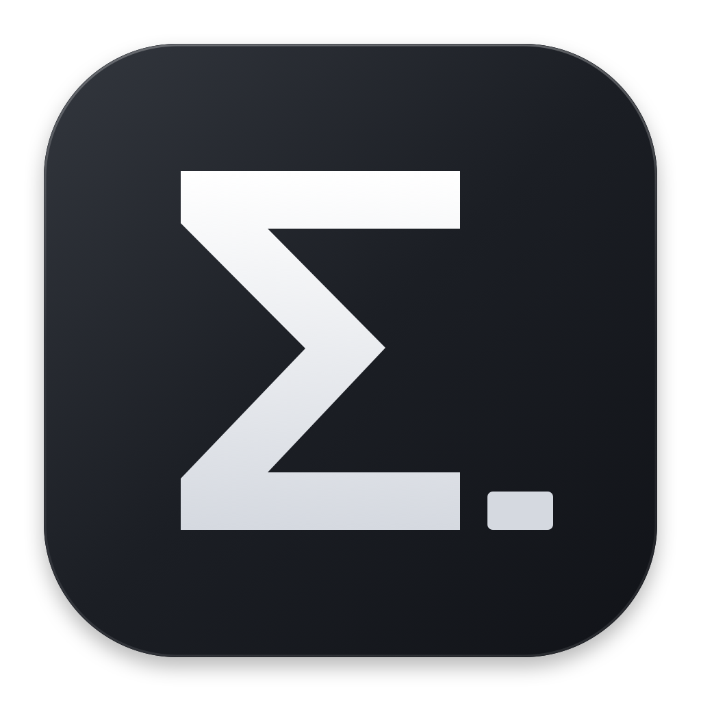
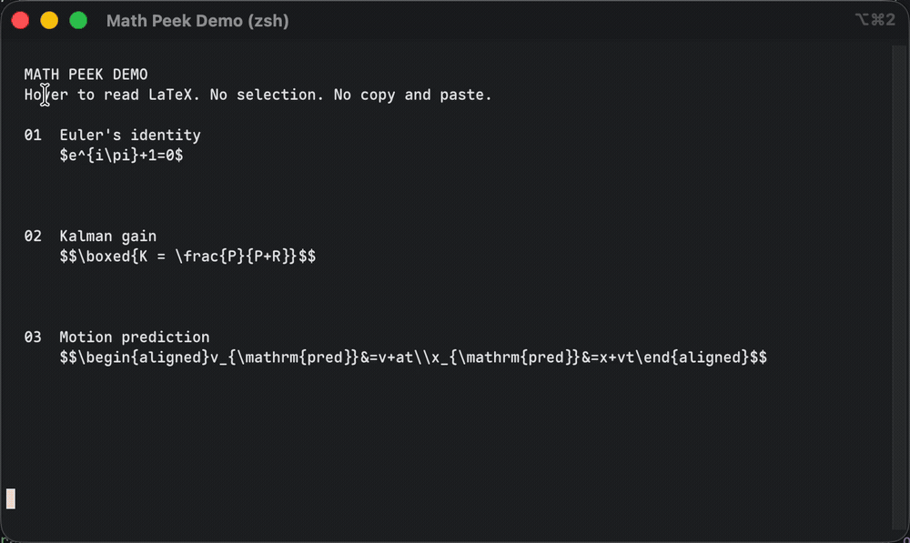

<p align="center"></p>

# Math Peek

**鼠标移到终端里的 LaTeX 上，直接看公式。**

独立的 macOS 菜单栏应用。不用框选、复制，也不用在 SSH 服务器或 tmux 里安装东西。
安装器、命令行工具、取字和悬停渲染均为原生实现，**不需要 Python**。

[English](README.en.md) · [下载最新版](https://github.com/dendenxu/math-peek/releases/latest)



## 安装

### Homebrew

```sh
brew install --cask dendenxu/tap/math-peek
open -a "Math Peek"
```

安装预编译应用及 `math-peek` 命令，不需要 Swift 编译器或 Python。
较新的 Homebrew 如果提示 `untrusted tap`，先信任这个 cask，再重试安装：

```sh
brew trust --cask dendenxu/tap/math-peek
```

更新时先从菜单栏退出 Math Peek，再运行：

```sh
brew upgrade --cask dendenxu/tap/math-peek
```

### 直接下载

从 [GitHub Releases](https://github.com/dendenxu/math-peek/releases/latest) 下载
`Math.Peek-1.1.1-universal.zip`，解压后把 `Math Peek.app` 拖到“应用程序”，然后打开。
同一个应用支持 Apple Silicon 和 Intel Mac，要求 macOS 13 或更新版本。

当前发布包已做本地签名，但**尚未经过 Apple 公证**。如果首次打开被 macOS 拦截，
请到“系统设置 → 隐私与安全性”确认该应用并选择“仍要打开”。Release 附带 SHA256 校验文件。

### 从源码安装

需要 Swift 5.9 或更新版本。新版 Xcode Command Line Tools 可直接构建；
较旧的 Swift 工具链需要完整 Xcode 才能正确打包应用资源，安装器会检查并提示。
第一次构建会下载锁定版本的 SwiftMath 依赖。

```sh
git clone https://github.com/dendenxu/math-peek.git
cd math-peek
./install.sh
open "$HOME/Applications/Math Peek.app"
```

默认安装完整功能，并自动发现已安装的终端，**包括 iTerm2**；没有 `--skip-iterm`，
也不需要单独安装终端插件或开启 iTerm2 Python API。
源码安装将应用放在 `~/Applications/Math Peek.app`，命令放在 `~/.local/bin/math-peek`。

## 第一次使用

1. 打开 Math Peek，在设置页允许“辅助功能”访问。
2. 确认“悬停预览”已开启。设置页会显示当前启用的终端，常见应用会自动发现。
3. 切回终端，让它处于前台，把鼠标停在完整公式的字符上；不用点击或选中。
4. 鼠标移开公式，浮窗自动收起。可以按需要开启“登录时自动启动”。

可以在终端输出这两行试一下：

```sh
printf '%s\n' '$e^{i\pi}+1=0$' '$$\boxed{K = \frac{P}{P+R}}$$'
```

应用完成设置后常驻菜单栏 `M∑`，不需要一直打开阅读窗口。
可从 `M∑ → Setup...` 重新打开设置。

### 添加其他终端之后怎么用？

在设置页点击“添加终端”，或使用 `M∑ → Terminal Apps → Add Application...`，
选择对应的 `.app`。**添加成功后立即启用，不需要刷新或重启。**
随后切回这个终端，把鼠标停在公式上即可。

自研应用也可以这样添加。取消勾选会立即暂停该应用的悬停；移除后不会被自动重新加回。
`Automatically Find Terminals` 可以关闭自动发现，`Find Installed Terminals Now` 可以手动扫描。

“已添加”表示允许 Math Peek 从这个应用取字，不等于它提供了完整的辅助功能接口。
若没有弹出公式，先看设置页或菜单栏状态中的具体原因。

## 终端与权限

Math Peek 直接读取 macOS 辅助功能提供的原文和字符坐标，或 cmux 的原生字符网格，不使用 OCR，
也不需要屏幕录制权限。悬停要求终端提供足够的文字位置接口。

| 终端 | 取字方式 | 使用说明 |
| --- | --- | --- |
| iTerm2、系统 Terminal | 辅助功能文本与字符坐标 | 允许“辅助功能”后直接悬停 |
| Ghostty | 实验模式：辅助功能原文 + 当前窗格的原生网格尺寸 | 每个本地窗格运行 `math-peek connect ghostty`；适合普通输出，详见下节 |
| cmux | 本地 socket 提供原生可见字符网格 | 在本地窗格运行一次 `math-peek connect cmux`，并允许辅助功能 |
| WezTerm、Alacritty、kitty、Warp、Hyper | 读取应用提供的辅助功能文本与坐标 | 默认自动发现，兼容性取决于其接口实现 |
| 自研或其他 `.app` | 手动添加后读取辅助功能文本与坐标 | 需要公开可访问的文字和位置接口 |

自动发现名单不是对每个应用、版本和全部功能的兼容性保证。
无法可靠定位字符时会提示接口限制；仍可使用剪贴板和文件预览。
自研终端开发者可参考[原生接口要求与已核对的限制](docs/terminal-compatibility.md)。

### 连接 cmux

在 **cmux 的本地终端窗格**中运行（不要在 SSH 远端执行）：

```sh
math-peek connect cmux
```

Math Peek 会验证连接并显示结果，无需刷新或重启终端。连接后支持带分隔符的公式，
也支持裸 `\boxed{K = \frac{P}{P+R}}`。`M∑ → Terminal Apps → Connect cmux...`
可查看状态，`Disconnect cmux` 可删除保存的连接。cmux 0.64.24 已实测。

连接使用 cmux 授予当前 shell 的 capability，保存在 Math Peek 的钥匙串条目中；
不修改 cmux 的 socket 访问设置，也不运行输入、选择或调整终端尺寸的命令。
Math Peek 仅请求固定的读取接口，终端原文不会写入诊断文件。

cmux 尚未公开准确的文字边距。Math Peek 使用真实网格和单元格尺寸，
只在可能落点指向同一公式时弹出，并允许命中区域延伸到紧邻的完整空白行。
另一条公式、路径或普通文字会阻止这种延伸；大边距和不确定区域可能不触发。
若连接失败，更新 cmux 并新开一个本地窗格，再运行连接命令。
若升级后提示无法保存钥匙串，请在“钥匙串访问”中删除 `local.mathpeek.preview.cmux` 旧条目后重连。

### 连接 Ghostty（实验模式）

在 **Ghostty 的每个本地窗格**中运行，不要在 tmux、screen 或 SSH 里面执行：

```sh
math-peek connect ghostty
```

看到 `Connected this Ghostty pane` 后就可以悬停，无需刷新或重启。
命令会短暂查询当前终端的真实格子尺寸并输出配对标记；连接期间请暂停输入。
不修改 Ghostty 应用或配置，不需要额外后台服务、Python、OCR 或屏幕录制权限。
`Terminal Apps → Connect Ghostty (Experimental)...` 可查看说明，`Disconnect Ghostty` 可断开所有窗格。

配对仅保存在 Math Peek 当前进程内。新开窗格、重启 Math Peek、改字体/行距或屏幕缩放后请重连；
窗口调整大小后会重新校验，尺寸仍有歧义时菜单会提示重连。关闭窗格后会释放对应连接。
应用只读取已配对 TTY 的尺寸，不读取它的输入，也不读取其他进程的环境。

已在 Ghostty 1.3.1 验证普通输出、历史滚动、软换行、裸 `\boxed{K = \frac{P}{P+R}}`
和 shell 路径过滤。支持常见中文宽字符；未知字符宽度、缩进软换行、过大历史或不确定的边距会保守跳过。
**此模式仅面向普通追加式输出。** Ghostty 原文有约 500 ms 缓存，新内容可能稍后才出现；
全屏 TUI、擦除重绘和隐藏文字可能导致漏识别或误识别，无法通过外部读取完整排除。
见[实测反例和接口限制](docs/ghostty-research.md)。这不是对任意终端画面的精确网格支持。

## 公式与阅读窗口

支持 `$...$`、`$$...$$`、`\(...\)`、`\[...\]`，以及包含已知数学命令的独立裸 TeX。
若 Markdown 终端输出把独占行的 `\[` / `\]` 显示成 `[` / `]`，也会恢复并识别其中的公式。
完整的裸 `\boxed{...}` 也可以夹在普通句子中，不需要加 `$`；只在公式范围内触发。
支持多行 `aligned`、常见矩阵和完整外层 `\boxed{...}`。
浮窗按公式大小调整，过大时等比缩放；同一个公式内移动鼠标不会反复跳动。
没有人为悬停等待或窗口动画。

代码块、行内代码、`$HOME/Applications/...` 等 shell 路径和容易与金额混淆的文本会保守处理。
超出 SwiftMath 支持范围的语法显示原始文本；长篇 Markdown 可用菜单栏的 `Open Reader` 阅读。

| 操作 | 作用 |
| --- | --- |
| `Hover Formula Preview` | 开关悬停预览 |
| `Preview Clipboard` | 阅读剪贴板中的 Markdown / LaTeX |
| `Control-Command-M` | 在已启用终端中读取选区或可见文本；其他应用中预览剪贴板 |
| 阅读窗口“读取终端 / 跟随终端” | 原生读取选区或可见文本；跟随模式每两秒更新 |
| “纯 LaTeX 公式”模式 | 渲染没有外层分隔符的公式 |

整屏读取和跟随需要终端提供可访问的选区或可见文本，不会为了取字自动全选或修改剪贴板。
无法安全读取时会提示使用选区或剪贴板预览。整屏读取可用不代表终端同时提供悬停所需的字符坐标。

## 命令行

```sh
math-peek --clipboard
math-peek answer.md
cat answer.md | math-peek
math-peek --capture
math-peek --follow
```

文件和管道输入要求 UTF-8，最大 2 MB。Homebrew 安装会提供 `math-peek` 命令；
源码安装请把 `~/.local/bin` 加入 `PATH`。旧的 Python RPC `--serve` 已移除。

## 没有弹出公式？

- **刚添加应用**：无需刷新。确认它在 `Terminal Apps` 中已勾选，悬停总开关已开启，再切回终端。
- **提示辅助功能权限**：在“系统设置 → 隐私与安全性 → 辅助功能”允许 Math Peek。
- **提示无法定位字符**：终端缺少悬停所需的原生接口；允许辅助功能或重新添加应用不能补齐该接口，可先用剪贴板预览。
- **升级后失效**：当前版本使用临时（ad-hoc）签名，更新或重新构建可能使旧辅助功能授权失效。先尝试重新开启 Math Peek 的辅助功能开关；如果设置中已开启，但 Math Peek 的设置页仍提示未授权，再删除旧条目，用“+”重新加入当前安装的 `Math Peek.app` 并开启。以 Math Peek 自身显示的权限状态为准；开关已能恢复权限时，无需删除重加。
- **公式未识别**：先用上面的两个完整示例验证；不完整分隔符、代码块或无法读取的终端区域不会强行弹窗。
- **文字能读但语法不支持**：尝试复制到阅读窗口，或改写为 SwiftMath 支持的形式。

诊断位于 `~/Library/Caches/Math Peek/`，只记录状态、权限和耗时，不包含终端文字。
状态日志和登录启动状态查询均在后台执行，避免磁盘或系统服务阻塞悬停。

## 开发与发布

```sh
scripts/test_native.sh
node --test web/core.test.cjs
./scripts/build_release.sh
```

`VERSION` 控制版本号；发布脚本生成双架构 ZIP 与 SHA256 文件。
推送 `v<版本>` tag 可触发 GitHub Actions 构建发布。默认使用本地签名；
只有提供真实的 `DEVELOPER_ID_APPLICATION` 和 `NOTARY_PROFILE` 才进行开发者签名与 Apple 公证。

原生渲染使用 SwiftMath；阅读窗口使用本地打包的 KaTeX、marked 和 DOMPurify。
第三方字体与库的许可证随应用一起分发。
