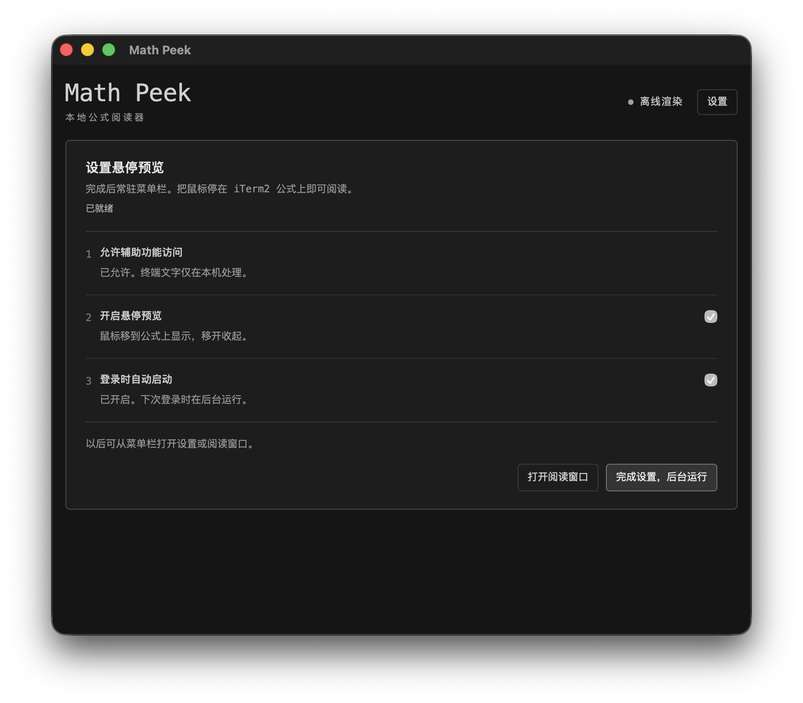

<p align="center"></p>

# Math Peek

Hover over LaTeX in compatible terminal apps and read the rendered formula in a small macOS popup.
No selection, remote installation, terminal image protocol, or Python process
is needed for hover. Math Peek reads local accessibility text, extracts formulas
in compiled Swift, and renders them with SwiftMath using AppKit and CoreText.
The optional reading window uses bundled KaTeX for longer Markdown responses.


The popup uses a monochrome glass background, follows the formula's size down
to a 40 x 34 point minimum, and does not take keyboard focus. Oversized formulas
are scaled proportionally to fit the available space. There are no animations
or intentional hover delay. Mouse position is checked approximately every 16 ms;
this is the polling interval, not a guarantee of total rendering latency.

## Install

Requires macOS 13 or later, Python 3 for the installer, and Xcode Command Line
Tools with Swift 5.9 or later (`xcode-select --install` if needed). The first build
needs network access to download the SwiftMath revision pinned in `Package.swift`.

```sh
git clone https://github.com/dendenxu/math-peek.git
cd math-peek
python3 install.py --skip-iterm
open "$HOME/Applications/Math Peek.app"
```

This builds the app and installs native hover, its math font resource bundle,
and the clipboard/file reader. To also enable the
optional iTerm2 selection/screen capture, follow mode, and RPC integration, use
`python3 install.py` without `--skip-iterm`. Those features install Python
dependencies into a private environment under
`~/Library/Application Support/Math Peek/runtime`.

The app is installed in `~/Applications/Math Peek.app`. The Python command-line
launcher is linked at `~/.local/bin/math-peek`; keep the clone in place and add
`~/.local/bin` to your `PATH` if you want to use that command.

## First launch

The setup window walks through Accessibility permission, hover preview, and
launching at login. Allow **Math Peek** in **System Settings > Privacy & Security
> Accessibility**, choose whether to launch at login, then finish setup.

Math Peek runs in the menu bar without keeping a Dock icon or reading window
open. After setup is complete, a normal background launch creates no window or
WebKit view; those are created when you open the reader or setup. Use **Setup...**
from the `M∑` menu to revisit setup, **Open Reader** when
needed, or **Launch at Login** to change startup behavior. Login startup uses
macOS `SMAppService`; macOS may ask you to approve
it in **System Settings > General > Login Items**.



## Use

Bring an enabled terminal app to the foreground and move the pointer onto a formula. Move away to
dismiss the popup. Hover recognizes `$...$`, `$$...$$`, `\(...\)`, and `\[...\]`.
It also recognizes standalone raw TeX such as `\frac{a}{b}` and
`v_{\mathrm{pred}} = a_{\mathrm{world}}\Delta t`, including clear wrapped
continuations. Raw detection requires known math commands and a formula-shaped
line; it deliberately avoids guessing from ordinary prose or shell commands.
Matrices and `aligned` environments work within SwiftMath's supported syntax.
An outer `\boxed{...}` renders with a native outline around the formula.
Code spans and fenced code blocks are excluded; ambiguous currency is handled
conservatively. Unsupported math syntax is displayed as its original source.

| Control | Action |
| --- | --- |
| Menu bar `M∑ > Hover Formula Preview` | Enable or disable hover |
| Menu bar `M∑ > Terminal Apps` | Add, enable, disable, or remove a terminal application |
| Control-Command-M in iTerm2 | Open the selection, or visible screen, in the reader; requires optional capture integration |
| Control-Command-M in other apps | Preview the clipboard |
| Preview Clipboard | Open copied text from any app or terminal |
| Read Terminal / Follow Terminal | Capture once, or refresh the visible iTerm2 screen every two seconds |
| Pure LaTeX mode | Render a formula without delimiters in the reader |
| Services > Preview with Math Peek | Preview selected text in apps that support macOS text services |

The global shortcut works while Math Peek is running. It does not change shell
or iTerm2 key bindings. If another app owns the shortcut, use the menu bar or
reader buttons. Follow mode stops when the reading window closes or new
clipboard/file content is opened.

### 中文快速使用

首次启动按引导允许「辅助功能」、开启悬停，并选择是否登录时自动运行；完成后应用
留在菜单栏，不常驻 Dock 或阅读窗口。需要修改时点菜单栏 `M∑ → Setup...`。
默认启用 iTerm2。其他终端可在菜单栏 `M∑ → Terminal Apps → Add Application...` 中选择
对应的 `.app`，勾选启用；同一菜单可以停用或移除。让已启用的终端处于前台，把鼠标
移到公式上即可预览。不用框选，没有停留等待或动画；悬停
解析和渲染全部在 Swift 应用内完成，不启动 Python 或网页。SSH 和 tmux 不需要安装
任何东西。带分隔符的公式以及含已知数学命令的独立裸 TeX 都可识别；混在普通文字里
的裸 TeX 可以复制到阅读窗口，切换为「纯 LaTeX 公式」。浮窗按内容自适应大小，最小
为 40 x 34 点，过大的公式等比缩放以避免内容超出边界。

### Other terminal apps

Math Peek remains a standalone menu-bar app. In **Terminal Apps > Add Application...**,
select a terminal's `.app`, including a locally developed one. No Math Peek SDK,
terminal plugin, or IPC integration is needed. The app list persists across launches;
unchecking or removing an app immediately stops its hover preview. iTerm2 is enabled
by default, and an intentionally empty list stays empty after restarting.

Adding an app allows Math Peek to try its macOS Accessibility interface; it does
not establish compatibility. The terminal must expose an `AXTextArea`, readable
`AXValue`, and `AXRangeForPosition` mapping screen positions to UTF-16 text ranges.
`AXBoundsForRange` is also used when available to verify the hit. Apps that draw
only to a canvas or GPU surface without accessible text cannot support this path.
The menu and setup/reader status report missing text areas or position mapping. Clipboard
and file preview remain available independently of hover support.

The iTerm2 selection/screen capture, follow mode, and its Control-Command-M behavior
remain iTerm2-specific. Adding another app enables hover, not those optional features.

## Files, SSH, and tmux

Run these commands on the local Mac:

```sh
math-peek --clipboard
math-peek answer.md
cat answer.md | math-peek
math-peek --capture
math-peek --follow
```

The clipboard, file, and pipe workflows work with any terminal. Remote output
can be brought back over an ordinary SSH pipe:

```sh
ssh my-server 'cat /path/to/answer.md' | math-peek
ssh my-server 'tmux capture-pane -p -J -S - -t session:0.0' | math-peek
```

Hover uses each enabled app's accessibility interface. iTerm2 rejoins its native
soft wraps; other apps may expose different wrap or character-width behavior.
For tmux, Math Peek preserves math line breaks and repairs
split common commands such as `\fra` followed by `c` on the next row. Stable
vertical pane borders allow extraction from one pane, including ordinary CJK
and wide characters. Extra `│` decorations in a neighboring pane and horizontal
split junctions such as `┤` do not interrupt the hovered pane's formula. A new
border inside the hovered pane still stops extraction across that boundary.
An orphan `$$` left by a formula that scrolled off screen does not consume the
next formula's opening delimiter across a heading or explanatory prose.

Repairs are intentionally narrow: within matrix or aligned-style environments,
a lone trailing backslash on a recognizable row, or a damaged `\[8pt]` spacing
marker at the end of a row, can be restored to a TeX line break. Existing valid
line breaks are preserved. Missing mathematical symbols or operators are not
inferred from context.
The native renderer uses its default row spacing for `\\[8pt]`-style breaks;
unsupported spacing options are omitted instead of being drawn as math text.

This is a preview overlay; it does not replace characters inside the terminal.
Unrecognizable raw TeX, hidden tmux history, uncertain pane boundaries, and complex
emoji layouts cannot always be reconstructed. Exporting the target tmux pane
with `capture-pane -J` is useful for those cases. Very old scrollback may not be
exposed through iTerm2's accessibility interface. SwiftMath and the reader's
KaTeX support subsets of mathematical TeX, not arbitrary TeX documents;
unsupported syntax remains visible as text.
Reader inputs are limited to 2 MB.

## Permissions and local data

Hover requires Math Peek's macOS Accessibility permission. It does not require
iTerm2's Python API. Optional capture/follow features use that API and may need
**iTerm2 Settings > General > Magic > Enable Python API**, plus first-use
authorization. Clipboard and file preview work independently of either API.

Rendering is offline: SwiftMath's math fonts are included in
`Contents/Resources/SwiftMath_SwiftMath.bundle`; KaTeX, marked, DOMPurify, and the
reader's fonts are bundled separately. Pasted
remote images are not loaded, and preview links do not navigate. Content is not
stored in browser storage. Pipe and RPC handoff files use a private local
directory, `~/Library/Caches/Math Peek/Requests/`, and are deleted after the app
reads them. Files left by an interrupted handoff can be removed manually.

Quit Math Peek before reinstalling. This source build is signed locally; a
rebuild can change its code signature and invalidate Accessibility permission.
If hover stops after an update, remove the old Math Peek entry from Accessibility
settings, add `~/Applications/Math Peek.app` again, and enable it.

The setup and reading windows display hover permission status. Local diagnostics
in `~/Library/Caches/Math Peek/hover-status.json` record stage, permission, process,
and timing information. `~/Library/Caches/Math Peek/app-status.json` records setup,
hover, and login-startup state. Neither diagnostic file includes terminal text.

## Development

The native extractor is `native/HoverMath.swift`. Hover uses that implementation
directly; `integration/hover_math.py` is a reference implementation for tests.
`native/FormulaView.swift` handles native measurement and rendering. SwiftPM
builds the app from `Package.swift`; the installer copies SwiftMath's resource
bundle into the app so rendering works without the build checkout.
The optional iTerm2 adapter is documented in [integration/README.md](integration/README.md).

```sh
mkdir -p build
xcrun swiftc -O native/HoverMath.swift tests/native_math/main.swift -o build/native-math-tests
build/native-math-tests tests/native_math/fixtures.json
python3 -m unittest discover -s tests -v
node --test web/core.test.cjs
scripts/test_native.sh
```

The extractor suite checks parity with the Python reference. `scripts/test_native.sh`
builds the app and verifies native rendering, including long expressions,
multiline layout, fitting within the popup, source fallback, and successive
formula changes. Panel layout checks exercise the actual window-resizing path,
including transitions from a tall formula to a small fraction or single symbol.
For live pointer and hover-transition checks, raise the isolated
demo from `tests/hover_demo.py` in iTerm2, pause the installed app's hover, and run
`scripts/test_native.sh --live`. The probe needs Accessibility permission; live
checks move the pointer and refuse to read a focused window without the explicit
demo marker. Add `--occlusion` to test a target covered by the previous popup.
For the agent-output regressions, put `tests/tmux_regression_demo.py` in a
65-column right pane and its `--neighbor` / `--bottom` modes in two left panes,
then run `scripts/test_native.sh --live --regression`. This checks wrapped raw
TeX, damaged matrix/aligned row breaks, and a formula crossing the left panes'
horizontal split.
For full Kalman, matrix, and boxed examples, use `tests/tmux_full_formula_demo.py`
(optionally `--matrices` or `--boxed`) and run
`scripts/test_native.sh --live --full-formulas --occlusion`.
Use `--bundle-id YOUR.APP.ID` to exercise another application displaying the isolated
fixture. `--marker TEXT` can override its identifying marker. The harness checks only
the target app's focused window, including app-list removal during a pending read.
`tests/ax_probe/main.swift` also checks extraction against the demo's actual
accessibility text. Do not use private terminal captures as repository fixtures.

The SwiftMath revision is pinned in `Package.swift` and `Package.resolved`;
its MIT license is in `licenses/SwiftMath-LICENSE` and included in the installed
app. Its font bundle retains the included font licenses. Reader dependency versions
and their license files are in `web/vendor/`.
To uninstall, disable **Launch at Login** from the menu bar, quit the app, then remove
`~/Applications/Math Peek.app`, `~/Library/Application Support/Math Peek`, and
`~/.local/bin/math-peek`.
